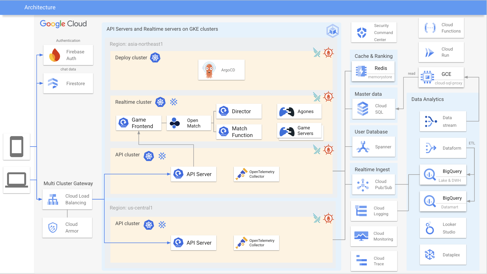

# gcp-manifests

## What is this repository?

This repository contains Terraform codes for Google Cloud, Kubernetes manifests, and other resources to build the system depicted in the following architecture diagram.
While this repository provides the sample codes, it demonstrates Cloud Native infrastructure capable of supporting Production-Ready applications.
The primary purpose of this repository is to facilitate my learning in building Cloud Native and Production Ready applications.

Note: this repository focuses solely on the infrastructure layer, including code and manifest files. It does not contain any application code.

## Architecture Diagram

